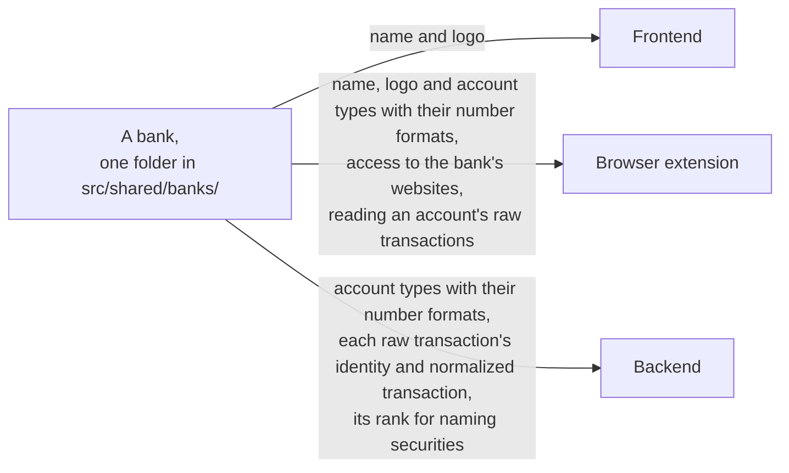

# Banks

```mermaid
flowchart LR
  bank["A bank,<br/>one folder in src/shared/banks/"]
  frontend["Frontend"]
  extension["Browser extension"]
  backend["Backend"]
  bank -- "name and logo" --> frontend
  bank -- "name, logo and account types with their number formats,<br/>access to the bank's websites,<br/>reading an account's raw transactions" --> extension
  bank -- "account types with their number formats,<br/>each raw transaction's identity and normalized transaction,<br/>its rank for naming securities" --> backend
```

Every app takes each bank folder there is, so adding or removing a bank's folder changes no app, only the checks in the [schema](../../src/backend/schema.sql) that list the known banks.
