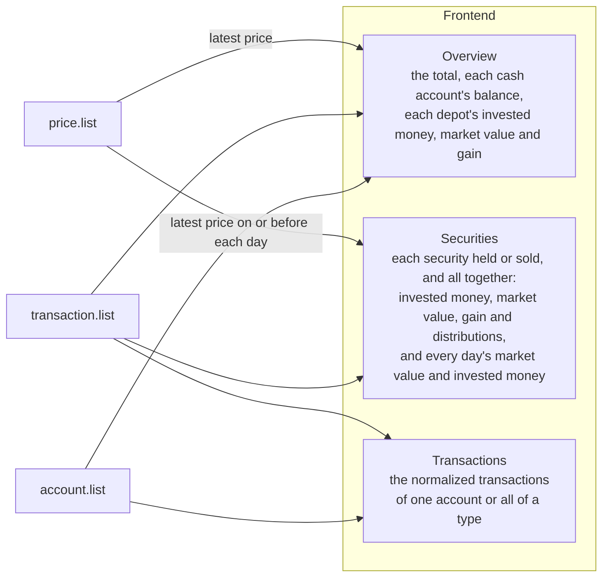

# Figures

```mermaid
flowchart LR
  accounts["account.list"]
  transactions["transaction.list"]
  prices["price.list"]
  subgraph frontend["Frontend"]
    overview["Overview<br/>the total, each cash account's balance,<br/>each depot's invested money, market value and gain"]
    securities["Securities<br/>each security held or sold, and all together:<br/>invested money, market value, gain and distributions,<br/>and every day's market value and invested money"]
    list["Transactions<br/>the normalized transactions<br/>of one account or all of a type"]
  end
  accounts --> overview
  accounts --> list
  transactions --> overview
  transactions --> securities
  transactions --> list
  prices -- "latest price" --> overview
  prices -- "latest price on or before each day" --> securities
```

The frontend adds up every figure in the browser from these lists, so the API serves no figures.
