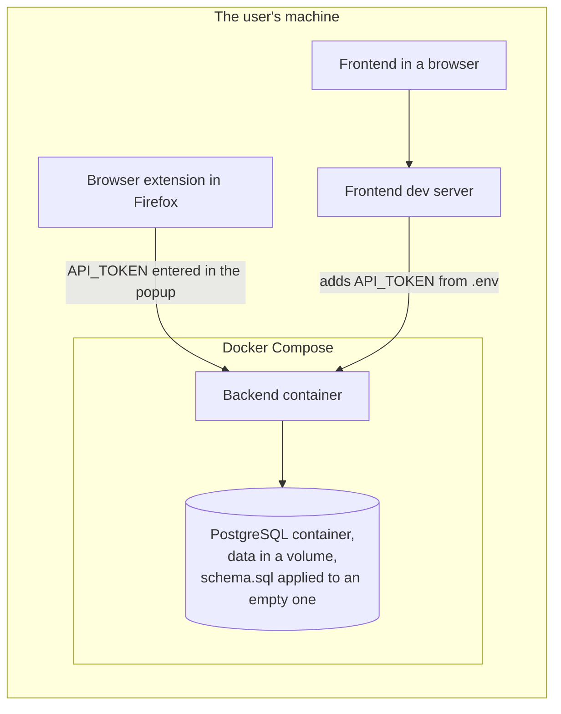

# Hosting

```mermaid
flowchart LR
  subgraph machine["The user's machine"]
    subgraph compose["Docker Compose"]
      backend["Backend container"]
      postgres[("PostgreSQL container,<br/>data in a volume,<br/>schema.sql applied to an empty one")]
    end
    extension["Browser extension in Firefox"]
    vite["Frontend dev server"]
    page["Frontend in a browser"]
  end
  extension -- "API_TOKEN entered in the popup" --> backend
  page --> vite
  vite -- "adds API_TOKEN from .env" --> backend
  backend --> postgres
```

Compose publishes both containers on `127.0.0.1` only, and the backend answers only requests that carry `API_TOKEN` as bearer token.
