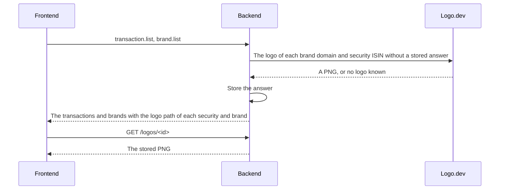

# Logos

```mermaid
sequenceDiagram
  participant FE as Frontend
  participant BE as Backend
  participant LD as Logo.dev
  FE->>BE: transaction.list, brand.list
  BE->>LD: The logo of each brand domain and security ISIN without a stored answer
  LD-->>BE: A PNG, or no logo known
  BE->>BE: Store the answer
  BE-->>FE: The transactions and brands with the logo path of each security and brand
  FE->>BE: GET /logos/<id>
  BE-->>FE: The stored PNG
```

Deleting a brand or changing its domain deletes its stored logo, so the next read fetches the new domain's.
