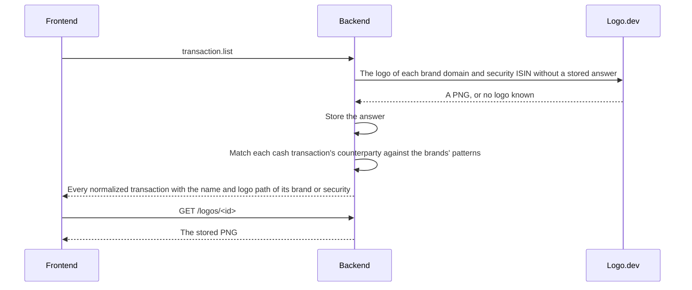

# Logos

```mermaid
sequenceDiagram
  participant FE as Frontend
  participant BE as Backend
  participant LD as Logo.dev
  FE->>BE: transaction.list
  BE->>LD: The logo of each brand domain and security ISIN without a stored answer
  LD-->>BE: A PNG, or no logo known
  BE->>BE: Store the answer
  BE->>BE: Match each cash transaction's counterparty against the brands' patterns
  BE-->>FE: Every normalized transaction with the name and logo path of its brand or security
  FE->>BE: GET /logos/<id>
  BE-->>FE: The stored PNG
```

The user inserts brands, the companies behind counterparties, into the database by hand, and no app manages them.
