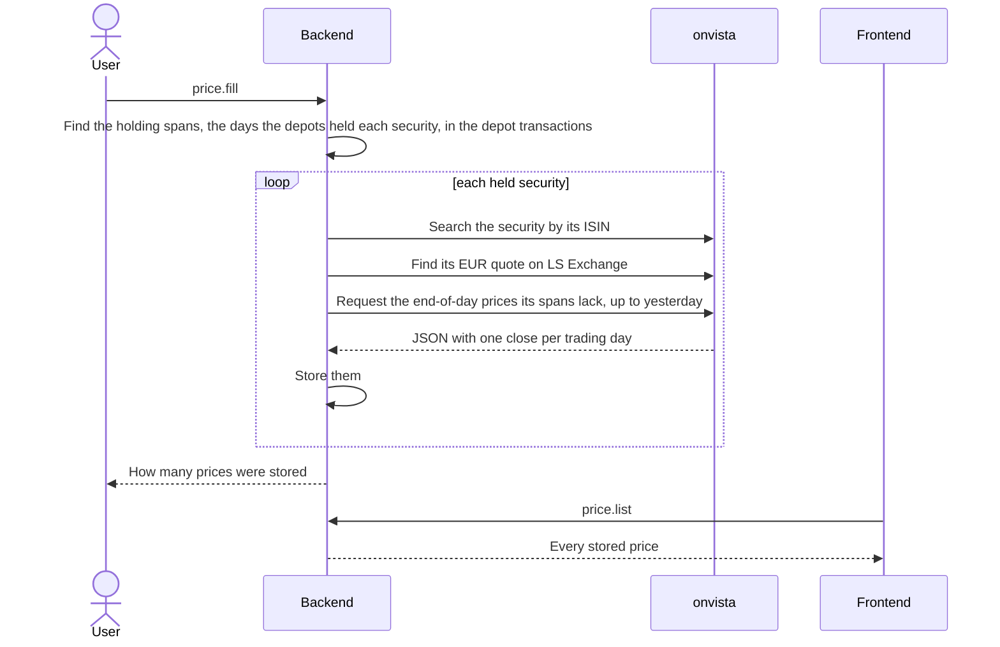

# Prices

```mermaid
sequenceDiagram
  actor User
  participant BE as Backend
  participant OV as onvista
  participant FE as Frontend
  User->>BE: price.fill
  BE->>BE: Find the holding spans, the days the depots held each security, in the depot transactions
  loop each held security
    BE->>OV: Search the security by its ISIN
    BE->>OV: Find its EUR quote on LS Exchange
    BE->>OV: Request the end-of-day prices its spans lack, up to yesterday
    OV-->>BE: JSON with one close per trading day
    BE->>BE: Store them
  end
  BE-->>User: How many prices were stored
  FE->>BE: price.list
  BE-->>FE: Every stored price
```
