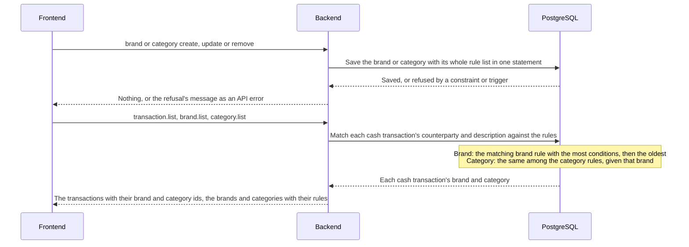

# Rules

```mermaid
sequenceDiagram
  participant FE as Frontend
  participant BE as Backend
  participant DB as PostgreSQL
  FE->>BE: brand or category create, update or remove
  BE->>DB: Save the brand or category with its whole rule list in one statement
  DB-->>BE: Saved, or refused by a constraint or trigger
  BE-->>FE: Nothing, or the refusal's message as an API error
  FE->>BE: transaction.list, brand.list, category.list
  BE->>DB: Match each cash transaction's counterparty and description against the rules
  Note over DB: Brand: the matching brand rule with the most conditions, then the oldest<br/>Category: the same among the category rules, given that brand
  DB-->>BE: Each cash transaction's brand and category
  BE-->>FE: The transactions with their brand and category ids, the brands and categories with their rules
```

The frontend reloads its data after each saved change, so a change applies to every transaction at once.
